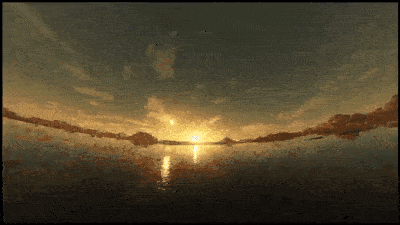

# Skybox Viewer
texture type auto-detected [HDRI | skybox]

## USAGE

  * URL params accepted
    - urls=[comma-separated URLs]
    - res=[1-8] (danger, >6 can be CPU intensive)
    - shape=[tetrahedron | cube | octahedron | dodecahedron | icosahedron]
      (for HDRI only)

### online demo
e.g. ```https://srmcgann.github.io/skybox_viewer/?urls=https://srmcgann.github.io/skyboxes/HDRI/11.jpg&res=6&shape=octahedron``` [link](https://srmcgann.github.io/skybox_viewer/?urls=https://srmcgann.github.io/skyboxes/HDRI/11.jpg&res=6&shape=octahedron
)
